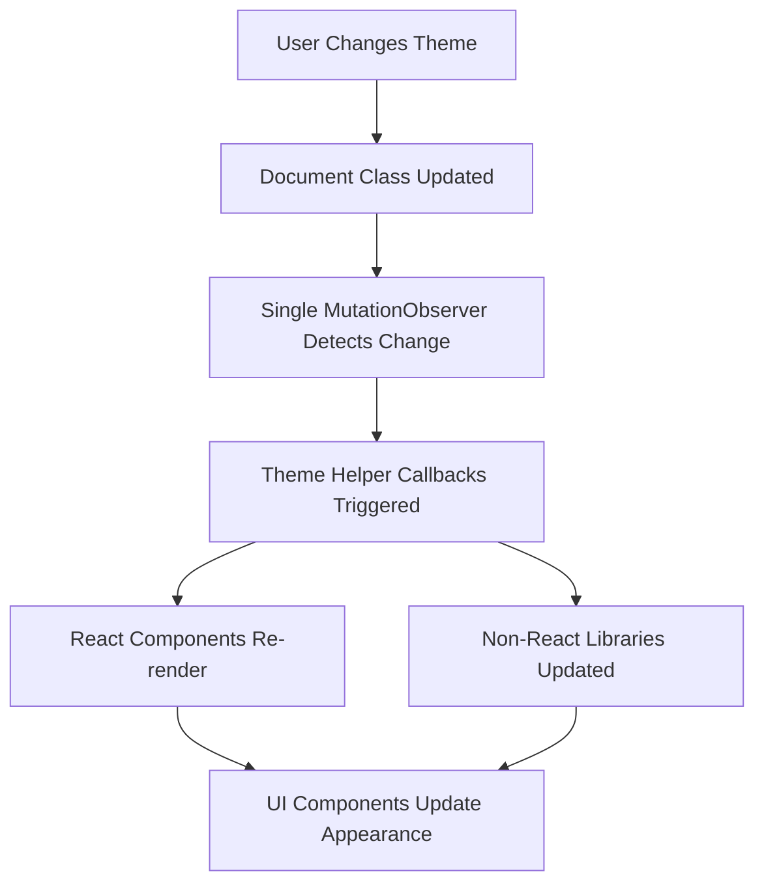

# Centralized Theme System Architecture

## Overview

Nodebook.js implements a robust, centralized theme detection and switching system that allows all UI components to automatically adapt to light/dark mode changes without duplicating logic or using multiple MutationObservers throughout the application.

## Core Architecture

### Theme Helper Utility (`src/lib/themeHelpers.ts`)

The centralized theme system is built around a single utility module that provides both React and non-React APIs for theme detection and management.

#### Key Functions

```typescript
// Theme Detection
getCurrentTheme(): ThemeMode           // Returns 'light' | 'dark'
isDarkMode(): boolean                  // Returns true if dark mode active
isLightMode(): boolean                 // Returns true if light mode active

// Library Integration Helpers
getReactJsonTheme(): ThemeKeys         // Returns 'rjv-default' | 'codeschool'
getCodeMirrorTheme(): string          // Returns 'light' | 'dark'

// React Integration
useTheme(): ThemeMode                  // Hook with automatic updates

// Non-React Integration
onThemeChange(callback): () => void    // Event listener with cleanup function
```

#### Implementation Details

- **Single MutationObserver**: One observer watches `document.documentElement` for class changes
- **Class-based Detection**: Detects theme by checking for `dark` class on `<html>` element
- **Automatic Cleanup**: All subscriptions provide cleanup functions to prevent memory leaks
- **Type Safety**: Full TypeScript support with proper type definitions

## Affected Components

### 1. ObjectDisplay Component (`src/components/ObjectDisplay.tsx`)

**Changes Made:**
- Imports `useTheme` and `getReactJsonTheme` from theme helpers
- Uses `useTheme()` hook for automatic theme updates
- Dynamically sets react-json-view theme based on current mode

**Implementation:**
```typescript
const currentTheme = useTheme();
const effectiveTheme = theme || getReactJsonTheme();
```

**Behavior:**
- Light mode: Uses `rjv-default` theme for react-json-view
- Dark mode: Uses `codeschool` theme for react-json-view
- Automatically updates when theme changes

### 2. CodeCell Component (`src/Components/CodeCell.tsx`)

**Changes Made:**
- Already implemented theme detection using `useTheme()`
- Dynamically switches CodeMirror theme based on current mode

**Implementation:**
```typescript
const currentTheme = useTheme();
const editorTheme = currentTheme === 'dark' ? oneDark : undefined;
```

**Behavior:**
- Light mode: Uses default CodeMirror light theme (undefined)
- Dark mode: Uses `oneDark` theme
- Theme switches automatically when mode changes

### 3. FormulaCell Component (`src/components/FormulaCell.tsx`)

**Changes Made:**
- Already implemented theme detection using `useTheme()`
- Dynamically switches CodeMirror theme based on current mode

**Implementation:**
```typescript
const currentTheme = useTheme();
const editorTheme = currentTheme === 'dark' ? oneDark : undefined;
```

**Behavior:**
- Light mode: Uses default CodeMirror light theme (undefined)
- Dark mode: Uses `oneDark` theme
- Theme switches automatically when mode changes

### 4. MarkdownCell Component (`src/components/MarkdownCell.tsx`)

**Changes Made:**
- Added `useTheme()` hook import and usage
- Replaced hardcoded `oneDark` theme with dynamic theme detection
- Now uses `editorTheme` variable instead of hardcoded theme

**Before:**
```typescript
<Editor theme={oneDark} />
```

**After:**
```typescript
const currentTheme = useTheme();
const editorTheme = currentTheme === 'dark' ? oneDark : undefined;
// ...
<Editor theme={editorTheme} />
```

**Behavior:**
- Light mode: Uses default CodeMirror light theme (undefined)
- Dark mode: Uses `oneDark` theme
- Theme switches automatically when mode changes

### 5. Editor Component (`src/components/Editor.tsx`)

**Status:** Already theme-aware
- Accepts `theme` prop and properly handles theme changes
- Uses compartmentalized theme system with proper reconfiguration
- No changes needed - parent components handle theme detection

## Theme Change Flow



### Detailed Flow

1. **Theme Change Trigger**
   - User changes theme in Settings
   - System preference changes (auto-detected)
   - Manual theme switching

2. **DOM Update**
   - `dark` class added/removed from `document.documentElement`
   - CSS variables and styles automatically update

3. **Detection**
   - Single MutationObserver in `themeHelpers.ts` detects class change
   - `getCurrentTheme()` returns updated theme mode

4. **Component Updates**
   - React components using `useTheme()` automatically re-render
   - Non-React code with `onThemeChange()` listeners gets callbacks
   - Library-specific theme functions return updated configurations

5. **UI Synchronization**
   - All CodeMirror editors switch themes
   - react-json-view components update appearance
   - Custom styled components adapt colors

## Benefits

### 1. **Eliminates Code Duplication**
- No need for MutationObserver in every component
- Single source of truth for theme detection
- Consistent theme logic across all components

### 2. **Automatic Synchronization**
- All components update simultaneously when theme changes
- No manual intervention required
- Works with theme changes from any source

### 3. **Performance Optimized**
- Single observer instead of multiple watchers
- Efficient event propagation
- Proper cleanup prevents memory leaks

### 4. **Developer Experience**
- Simple API for both React and non-React code
- Type-safe with full TypeScript support
- Clear separation of concerns

### 5. **Maintainability**
- Centralized theme logic is easier to maintain
- Adding new theme-aware components is straightforward
- Theme behavior is predictable and consistent

## Usage Patterns

### For New React Components

```typescript
import { useTheme, getReactJsonTheme } from '@/lib/themeHelpers';

function MyComponent() {
  const theme = useTheme();
  
  return (
    <div style={{
      backgroundColor: theme === 'dark' ? '#1f2937' : '#ffffff',
      color: theme === 'dark' ? '#f9fafb' : '#111827'
    }}>
      Content adapts to {theme} theme
    </div>
  );
}
```

### For Library Integration

```typescript
import { onThemeChange, getCodeMirrorTheme } from '@/lib/themeHelpers';

// Initialize library with current theme
const editor = CodeMirror.fromTextArea(textarea, {
  theme: getCodeMirrorTheme()
});

// Update when theme changes
const cleanup = onThemeChange(() => {
  editor.setOption('theme', getCodeMirrorTheme());
});

// Don't forget cleanup when component unmounts
return cleanup;
```

## Future Considerations

### Extensibility
- Easy to add new library-specific theme functions
- Theme detection can be extended for custom theme systems
- Component integration follows established patterns

### Performance
- Current implementation is efficient for the app's scale
- Could be optimized further with debouncing if needed
- Memory usage is minimal with proper cleanup

### Testing
- Theme detection is testable by manipulating DOM classes
- Component behavior can be tested by mocking theme state
- Integration tests can verify end-to-end theme switching

## Integration with Existing Systems

### Plotly Charts
- Has separate sophisticated theme system (`src/lib/plotlyDark.tsx`)
- Integrates with overall theme detection
- Uses similar MutationObserver pattern for chart styling

### Settings System
- Theme preferences stored in app settings
- SettingsView handles theme switching UI
- Theme changes propagate through centralized system

### CSS Variables
- Tailwind CSS handles most theme styling through CSS variables
- Components use semantic color names that adapt automatically
- Custom styles can use the same variable system

## Migration Notes

### From Previous Implementation
- Removed hardcoded `oneDark` theme usage in MarkdownCell
- All CodeMirror editors now use dynamic theme detection
- ObjectDisplay now uses centralized theme for react-json-view

### Breaking Changes
- None - all changes are backwards compatible
- Existing theme prop overrides still work
- Default behavior improved without breaking existing code

## Troubleshooting

### Common Issues
1. **Theme not updating**: Check if component is using `useTheme()` hook
2. **Memory leaks**: Ensure cleanup functions are called on unmount
3. **Inconsistent theming**: Verify all components use centralized helpers

### Debugging
```typescript
// Check current theme state
console.log('Current theme:', getCurrentTheme());
console.log('Is dark mode:', isDarkMode());

// Monitor theme changes
const cleanup = onThemeChange((newTheme) => {
  console.log('Theme changed to:', newTheme);
});
```

This centralized theme system provides a robust, maintainable, and efficient solution for handling theme changes across the entire Nodebook.js application.
